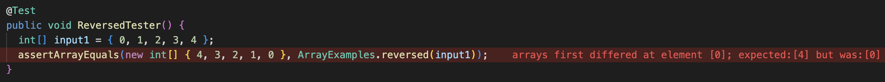

Week 1 Lab Report

__String Server__
> The String Server checks if the url states "/add-message?s=" and saves the message and displays them in order.

```
import java.io.IOException;
import java.net.URI;

class Handler implements URLHandler {
    // The one bit of state on the server: a number that will be manipulated by
    // various requests.
    // String output = "";
    int index = 0;
    String[] messages = new String[100];

    public String handleRequest(URI url) {
        messages[0] = "";

        if (url.getPath().equals("/")) {
            return String.format("Start Message: %s ", printMessages());

        } else {
            System.out.println("Path: " + url.getPath());
            if (url.getPath().contains("/add-message")) {
                String[] parameters = url.getQuery().split("=");
                if (parameters[0].equals("s")) {
                    if (parameters[1].equals(null)) {
                        return String.format("Current Message: %s", printMessages());
                    }
                    index++;
                    messages[index] = (parameters[1]);
                    return String.format("Message: %s", printMessages());
                }
            }
            return "404 Not Found!";
        }
    }

    public String printMessages() {
        String output = "";
        if (messages == null) {
            return output;
        }

        for (int i = 0; i < messages.length; i++) {
            System.out.println(messages[i]);

            if (messages[i] != null) {
                output = output + "\n" + messages[i];
            }
        }
        return output;
    }

}

class StringServer {
    public static void main(String[] args) throws IOException {
        if (args.length == 0) {
            System.out.println("Missing port number! Try any number between 1024 to 49151");
            return;
        }

        int port = Integer.parseInt(args[0]);

        Server.start(port, new Handler());
    }
}
```


>—————————————————————————————————————————————————————————————————————

>—————————————————————————————————————————————————————————————————————
>The screenshot above shows three messages being saved to the server. The methods being used include the handleRequest and the printMessages methods. The handleRequest method takes in the url and splits the information into two sections, an "add-message" text and the message itself, which is added to an array that stores all of the messages the user types into the URL. The printMessages method takes the message and outputs a string that is printed to the website. The text "Message1" is added to the first spot on the array, the text "second message" is added to the second spot on the array, and the text "third line"  is added to the third index on the array.
>—————————————————————————————————————————————————————————————————————

>—————————————————————————————————————————————————————————————————————
>The screenshot above shows two new messages being saved to the server. The methods being used include the handleRequest and the printMessages methods. The handleRequest method takes in the url and splits the information into two sections, an "add-message" text and the message itself, which is added to an array that stores all of the messages the user types into the URL. The printMessages method takes the message and outputs a string that is printed to the website. The text "next line" is added to the fourth spot on the array, and lastly the text "this is the fifth index" is added to the fifth index of the messages array.
>—————————————————————————————————————————————————————————————————————

__Bugs from Lab 3__ 

>—————————————————————————————————————————————————————————————————————
* A failure-inducing input for the buggy program, as a JUnit test and any associated code (write it as a code block in Markdown)
>—————————————————————————————————————————————————————————————————————
``` failure inducing code ```
>—————————————————————————————————————————————————————————————————————

>—————————————————————————————————————————————————————————————————————
* An input that doesn’t induce a failure, as a JUnit test and any associated code (write it as a code block in Markdown)
>—————————————————————————————————————————————————————————————————————
``` working code ```
>—————————————————————————————————————————————————————————————————————

>—————————————————————————————————————————————————————————————————————
* The symptom, as the output of running the tests (provide it as a screenshot of running JUnit with at least the two inputs above)
>—————————————————————————————————————————————————————————————————————

>—————————————————————————————————————————————————————————————————————
* The bug, as the before-and-after code change required to fix it (as two code blocks in Markdown)
>—————————————————————————————————————————————————————————————————————
``` before code ```
>—————————————————————————————————————————————————————————————————————
``` after code ```
>—————————————————————————————————————————————————————————————————————

__Something New I Learned__

>—————————————————————————————————————————————————————————————————————
* From the lab we did in week two, I learned how to create and run a locally hosted web server.
* Additionaly, I learned how to give functionallity web server by creating a program and running with my server.
* Moreover, I learned how to create a pages server on github that allows me to publicly access the site.
>—————————————————————————————————————————————————————————————————————